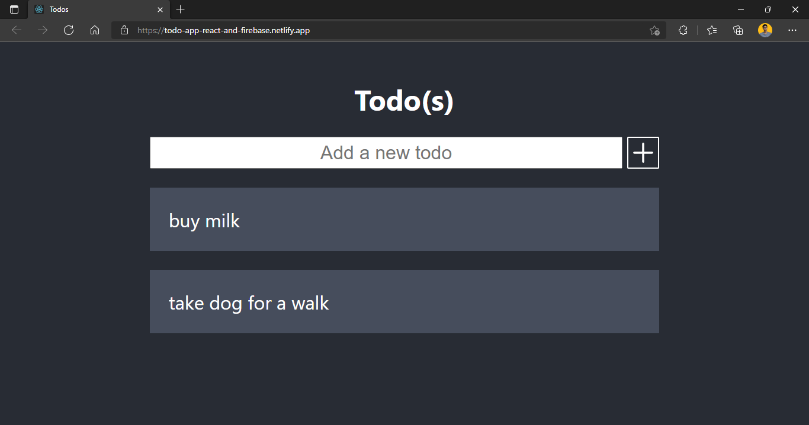

# Todo App | React + Firebase

Simple todo app built using [React](https://reactjs.org/docs/getting-started.html) and [Firebase](https://firebase.google.com/?gclid=Cj0KCQiAi9mPBhCJARIsAHchl1yVXvLF4p7lfOFmaU3cz-AmRQ5Fh9iou1tjTs3Ml5o-EweU4wgHFU0aAtL6EALw_wcB&gclsrc=aw.ds)

## Demo

https://todo-app-react-and-firebase.netlify.app/

## Screenshots

